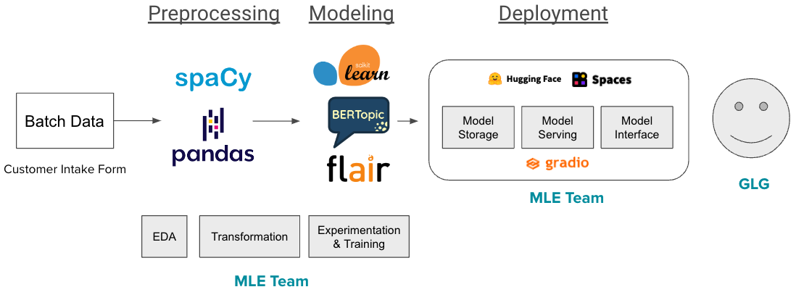

# GLG: Automated Text Analysis for Improved Service Demand

By Julia Nickerson and Curtis Pond

### Problem Definition

GLG helps people make smarter decisions by connecting them to experts. Hundreds of requests are submitted daily to GLG via an intake form. GLG wants to help people reach experts faster by:
1. Grouping common topics together
2. Grouping similar client requests together
3. Identifying underlying patterns in the data (NER, time-based patterns)

### 1. Data :page_with_curl: 

#### Two Datasets: NER Corpus & All the News 2.0

|             | NER Corpus                                                                                                | All the News 2.0                                                                                                |
|-------------|-----------------------------------------------------------------------------------------------------------|-----------------------------------------------------------------------------------------------------------------|
| Description | * 47,959 sentences  * Includes each word’s part-of-speech (noun, verb, etc.) and NER (geo, org, per, etc.) | * 27 million news articles published between 2016 and 2020  * Includes date, author, title, and publication name |
| Size        | ~15 MB                                                                                                    | ~9 GB                                                                                                           |
| Labels      | Labeled                                                                                                   | Unlabeled                                                                                                       |
| Task        | Supervised learning (named entity recognition)                                                            | Unsupervised learning (clustering) and supervised learning (text classification)                                                                              |

### 2. Approach  :boom: 

This project covers four areas of NLP/ML to meet the needs of the business and resourcefulness of GLG’s current data pipelines for efficient data storage and retrieval.

1. Detection of topics and keywords
2. Named Entity Recognition (NER)
3. Grouping similar requests together (unsupervised learning)
4. Temporal direction of the customer request

### 3. Deliverables :dart: 

1. A deployable ML model that performs NER with reasonable accuracy.
2. A text classification ML model that can group text into of three categories: healthcare, technology, or other.
3. A clustering ML model to find patterns from submitted topics or requests.
4. A hierarchical clustering method that can produce a hierarchical dendrogram of topics submitted over a period of time.
5. Some type of lightweight web interface for customers to interact with the model (e.g., Gradio for interface, HuggingFace Spaces for hosting). Example: [NER demo on Hugging Face](https://huggingface.co/spaces/jnick/NER)

### 4. Tech Stack

### 5. Limitations of Models / Data / ML Pipeline
1. Text classification model built on 100K news articles, not actual GLG data.
2. Topic clustering model, including temporal analysis, to be used offline on large batch data.
3. Temporal analysis conducted on 100K news articles, not actual GLG data. The standalone-analysis should be used as a proof-of-concept for how it can be used on actual GLG data.
4. Named Entity Recognition (NER) model is based on a public corpus, not actual GLG data.
5. NER model has poorer performance for tags not commonly seen in the training dataset, specifically events (**eve**), natural objects (**nat**), and manmade artifacts (**art**).

### 6. How to Access Our Model
1. The full working solution (NER and Text Classification) will be available on or around Feb 23, 2023: 
https://huggingface.co/spaces/curtpond/mle10-glg-demo

### 6. Resources :clapper: 

1. [EDA](https://github.com/nickersonj/glg-capstone/tree/main/EDA)
2. [Modeling](https://github.com/nickersonj/glg-capstone/tree/main/modeling)
3. [Explainability](https://github.com/nickersonj/glg-capstone/tree/main/explainability)
4. [Deployment](https://github.com/nickersonj/glg-capstone/tree/main/deployment)
5. [Final Capstone Presentation](https://github.com/nickersonj/glg-capstone/blob/main/final_capstone_jn-cp.pdf)
3. [Original Project Pitch (2022-01-19) slides](https://github.com/nickersonj/glg-capstone/tree/main/Project_Pitch_Slides_2022-01-19.pdf)
